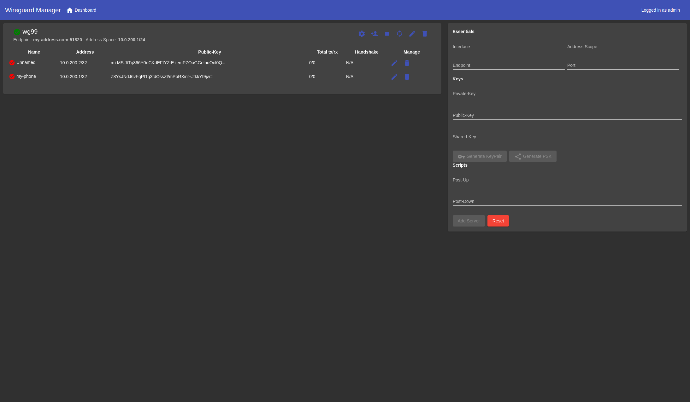
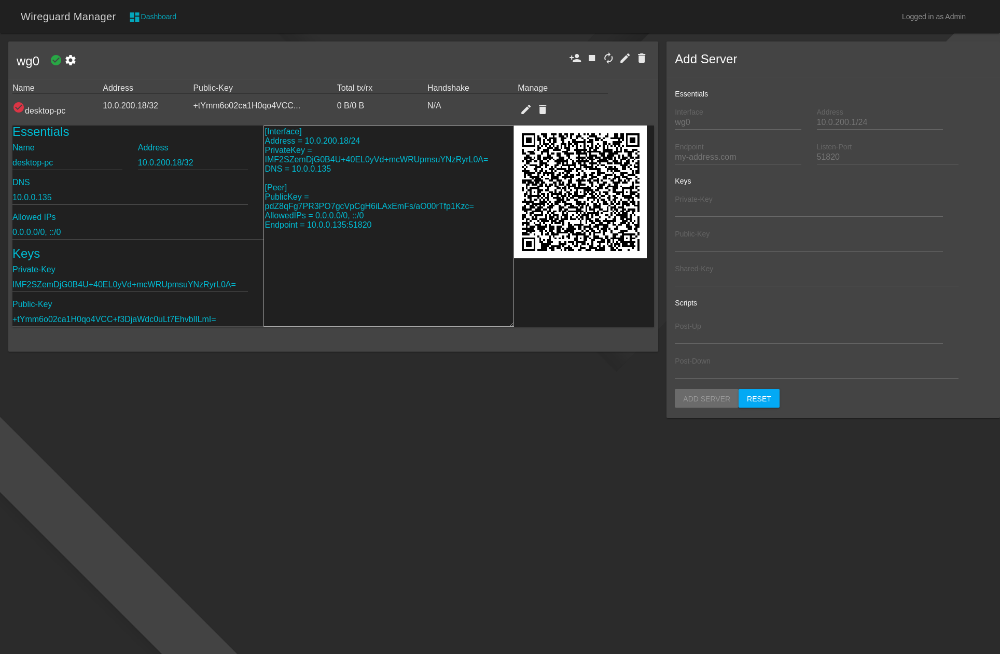
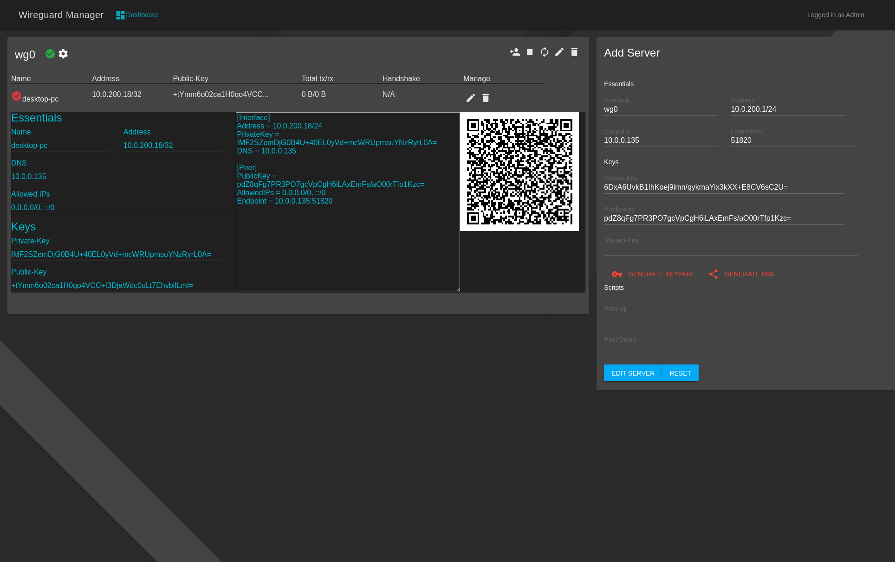
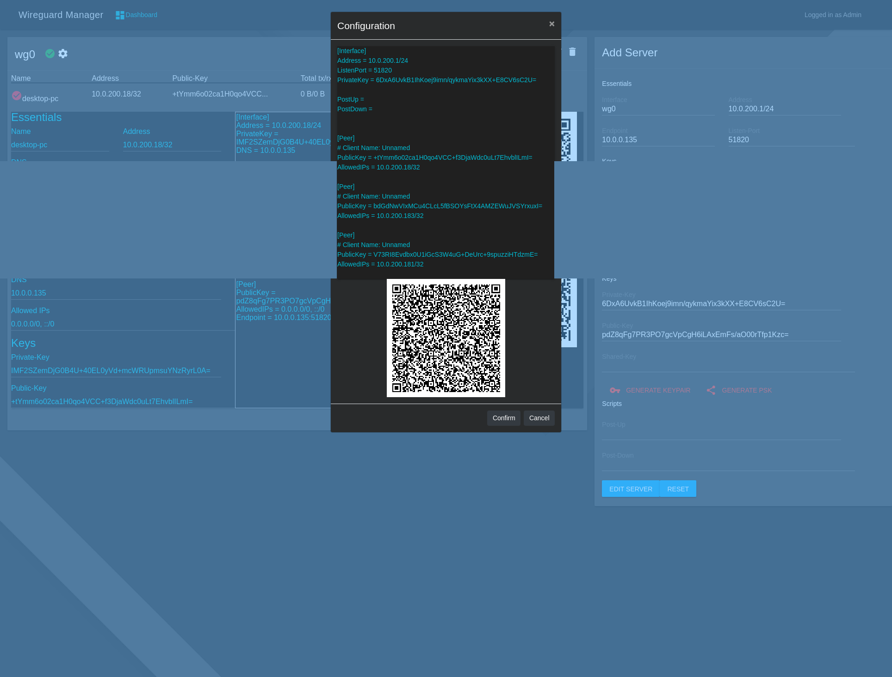
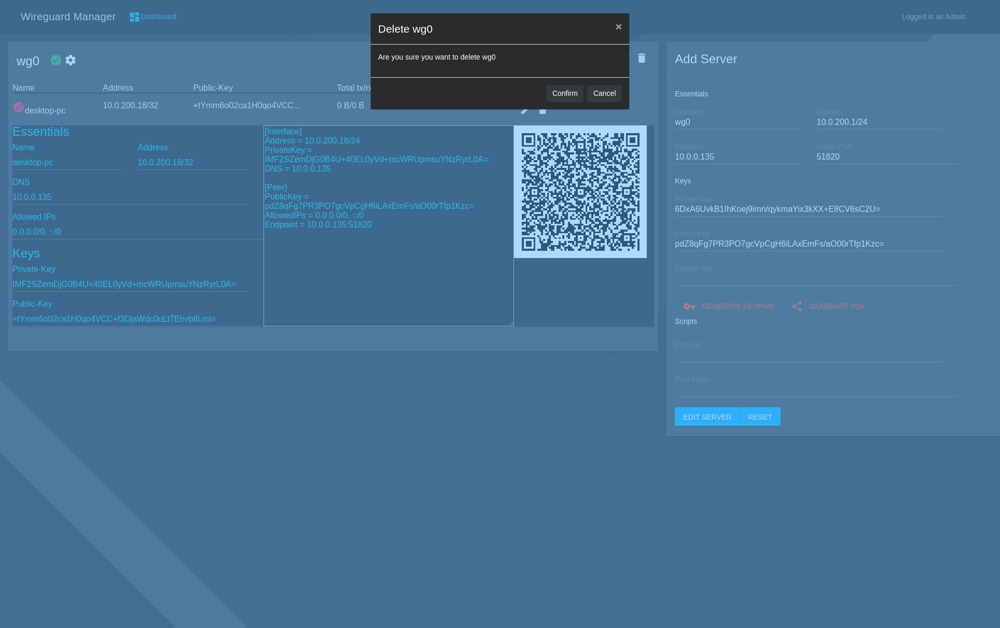
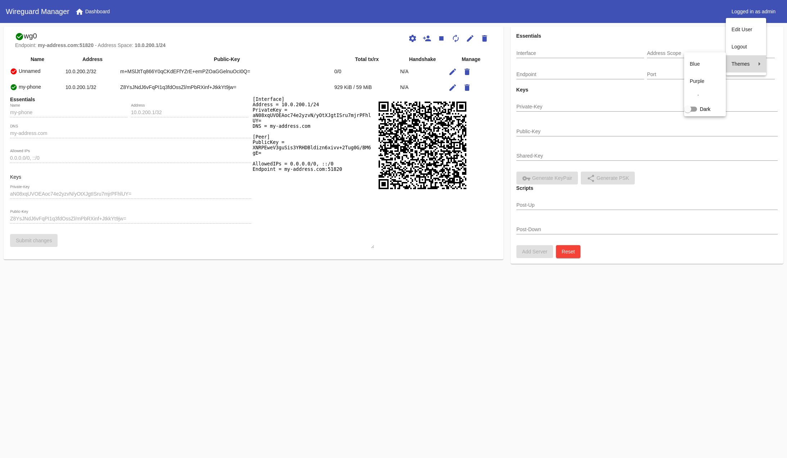
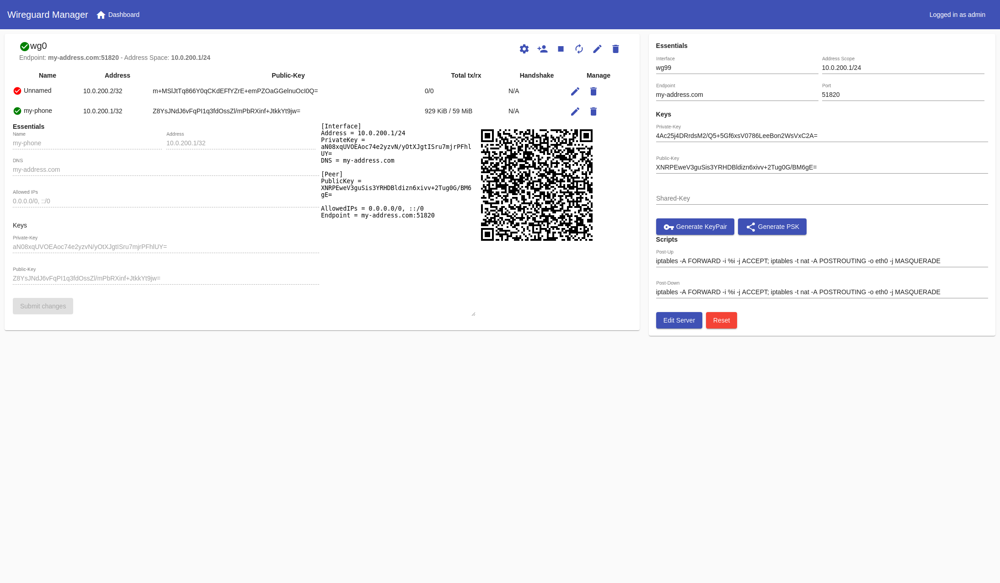
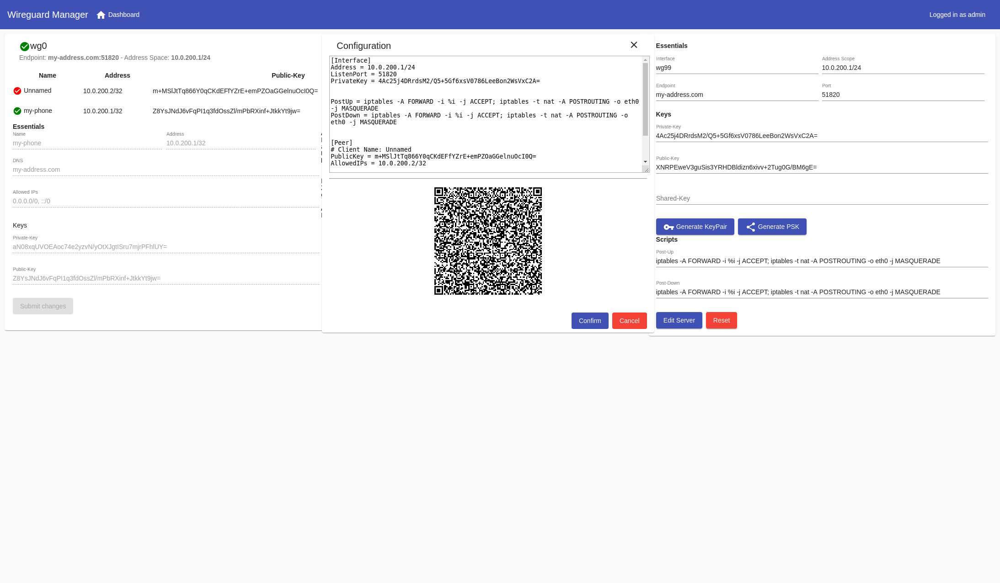
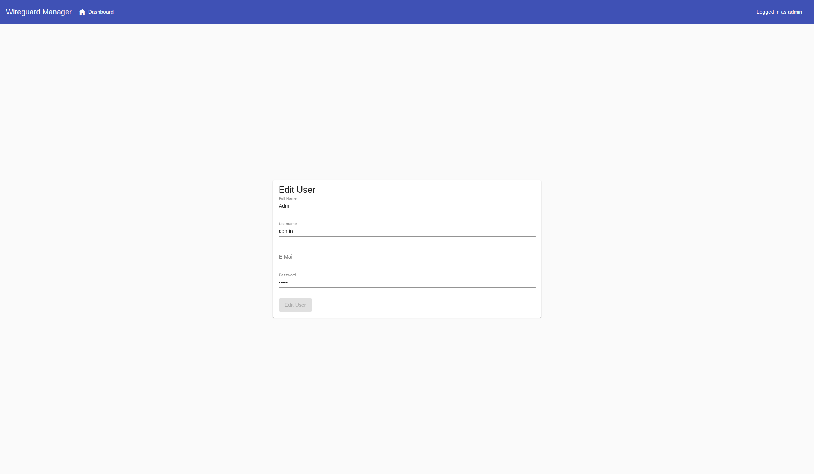

# wg-manager
The wg-manager provides an easy-to-use graphical web interface to import, setup, and manage WireGuard server(s).
[See Here](https://github.com/perara/wg-manager#Showcase)

The features of wg-manager includes:

**Server**
* Create/Delete/Modify
* Start/Stop/Restart server
* Import existing

**Peer**
* Create/Delete/Modify
* Bandwidth usage statistics
* Export by QRCode, Text

**General**
* Modify Admin User

# Dependencies
* Linux >= 5.6 *(Alternatively: wireguard-dkms)*

# Common Installation Steps
1. Enable ip forwarding with `sysctl -w net.ipv4.ip_forward=1`
    * To make the forwarding persistent add `net.ipv4.ip_forward = 1` to `/etc/sysctl.d/99-sysctl.conf`
2. It is recommended to have a firewall protecting your servers

## Notes
* A few people has experienced issues with running the dockerized method using bridged networking. To fix this, you can use `network_mode: host`. Note that you can no longer reverse-proxy the web interface from reverse proxies such as [jwilder/nginx-proxy](https://hub.docker.com/r/jwilder/nginx-proxy/).

## Method #1: Docker-compose
```yaml
  wireguard:
    container_name: wg-manager
    image: perara/wg-manager
    restart: always
    cap_add:
      - NET_ADMIN
    #network_mode: host # Alternatively
    ports:
       - 51800-51900:51800-51900/udp
       - 8888:8888
    volumes:
      - ./wg-manager:/config
    environment:
      HOST: 0.0.0.0
      PORT: 8888
      ADMIN_PASSWORD: admin
      ADMIN_USERNAME: admin
      WEB_CONCURRENCY: 1
```
or [plain docker here](./docs/guides/docker_configuration.md)

# Method #2: Bare Metal
- [Installation on Debian/Ubuntu/RPI4](./docs/install.md)

# Guides
- [Importing Existing configuration](./docs/guides/import_existing_server.md)
- [Reverse Proxy](./docs/guides/reverse_proxy.md)

# Usage
When docker container/server has started, go to http://localhost:8888


# Environment variables
| Environment      | Description                                                               | Recommended |
|------------------|---------------------------------------------------------------------------|-------------|
| GUNICORN_CONF    | Location of custom gunicorn configuration                                 | default     |
| WORKERS_PER_CORE | How many concurrent workers should there be per available core (Gunicorn) | default     |
| WEB_CONCURRENCY  | The number of worker processes for handling requests. (Gunicorn)          | 1           |
| HOST             | 0.0.0.0 or unix:/tmp/gunicorn.sock if reverse proxy. Remember to mount    | 0.0.0.0     |
| PORT             | The port to use if running with IP host bind                              | 80          |
| LOG_LEVEL        | Logging level of gunicorn/python                                          | info        |
| ADMIN_USERNAME   | Default admin username on database creation                               | admin       |
| ADMIN_PASSWORD   | Default admin password on database creation                               | admin       |

# Showcase


















# Roadmap
### Primaries
- Implement multi-server support (setting up site-2-site servers from the GUI)
- Extending multi-server support to enable custom access lists (A peer can be assigned to multiple servers, as part of the ACL)

### Other
* Eventual bugfixes
* Improve Auth
* Improve everything...
